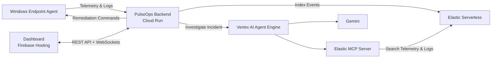
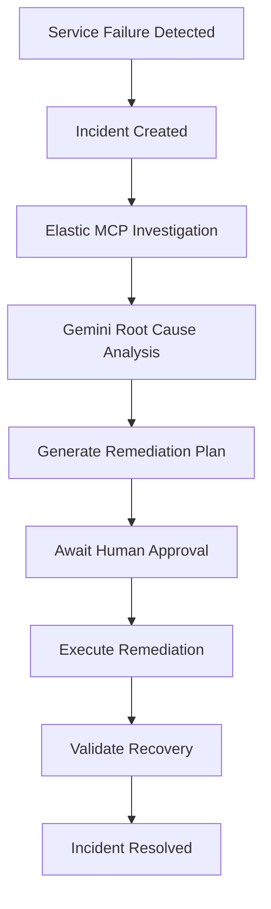
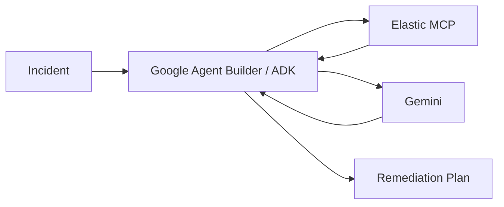
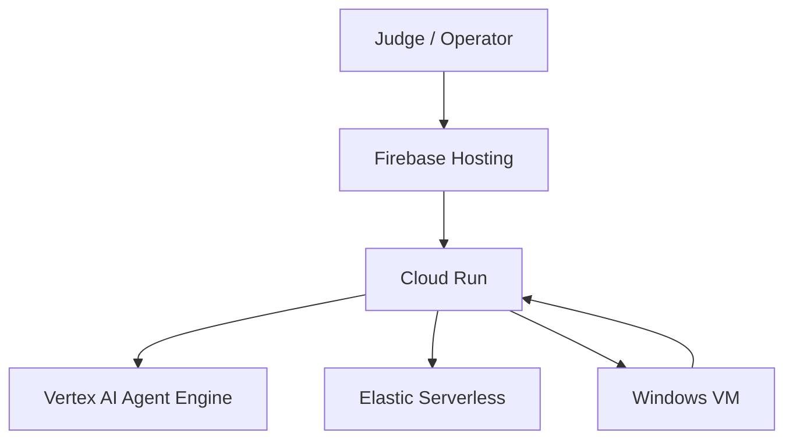

# PulseOps AI

<p align="center">
  
</p>

<h1 align="center">PulseOps AI</h1>

<p align="center">
Transforming Observability into Autonomous Action
</p>

<p align="center">
An autonomous incident-response agent built with Gemini, Google Cloud Agent Builder, and Elastic MCP.
</p>

---

## Overview

PulseOps AI is an autonomous incident-response platform that detects operational failures, investigates telemetry and logs, determines root causes, generates remediation plans, executes approved actions, validates recovery, and produces incident summaries.

Unlike traditional monitoring solutions that only generate alerts, PulseOps AI performs the complete incident-response workflow.

---

## Problem Statement

Modern observability platforms excel at detecting incidents, but human operators are still responsible for:

* Investigating telemetry and logs
* Identifying root causes
* Creating remediation plans
* Executing fixes
* Validating recovery

This process is repetitive, time-consuming, and often delays incident resolution.

PulseOps AI bridges this gap by transforming observability into action.

---

## Key Features

* Real-time endpoint telemetry monitoring
* Autonomous incident detection
* Gemini-powered root cause analysis
* Elastic MCP integration
* Human approval workflow
* Automated remediation execution
* Recovery validation
* Incident timelines and summaries
* Real-time dashboard updates using WebSockets
* Live endpoint monitoring
* Interactive incident simulation mode

---

## System Architecture



---

## Incident Response Workflow



---

## Agent Workflow



---

## Deployment Architecture



---

## Technology Stack

### Google Cloud

* Gemini
* Google Cloud Agent Builder
* Google ADK
* Vertex AI Agent Engine
* Cloud Run
* Firebase Hosting
* Compute Engine
* Secret Manager
* Cloud Build

### Elastic

* Elastic Serverless
* Elasticsearch
* Kibana
* Elastic MCP Server

### Backend

* Go
* REST APIs
* WebSockets

### Frontend

* React
* TypeScript
* Vite

---

## Screenshots

### Dashboard


### Incident Investigation


### Remediation Workflow


---

## Demo

### Hosted Application

https://pulseops-agent.web.app

### Demo Video

https://youtube.com/watch?v=YOUR_VIDEO_ID

---

## Running Locally

### Prerequisites

* Go 1.24+
* Node.js 22+
* Google Cloud Project
* Elastic Deployment
* Vertex AI Agent Engine

### Clone Repository

```bash
git clone https://github.com/your-org/pulseops-ai.git

cd pulseops-ai
```

### Backend

```bash
cd backend

go mod download

go run ./cmd/server
```

### Frontend

```bash
cd frontend

npm install

npm run dev
```

---

## Deployment

### Backend

```powershell
pwsh -File .\scripts\deploy-backend-cloudrun.ps1
```

### Frontend

```powershell
pwsh -File .\scripts\deploy-frontend-firebase.ps1
```

### Endpoint Agent

```powershell
pwsh -File .\scripts\create-agent-vm.ps1
```

---

## Demo Mode

PulseOps AI includes an incident simulation mode that allows users to launch incidents on demand and observe the complete lifecycle:

```text
Detect
→ Investigate
→ Analyze
→ Approve
→ Execute
→ Validate
→ Resolve
```

This enables reliable demonstrations while preserving the real Gemini, Agent Builder, and Elastic MCP workflow.

---

## Future Work

* Multi-endpoint fleet management
* Kubernetes remediation
* Security incident response
* Deployment rollback automation
* Predictive incident prevention
* Multi-agent workflows

---

## License

MIT License

See the LICENSE file for details.

---

## Acknowledgements

Built for the Google Cloud Rapid Agent Hackathon using:

* Google Gemini
* Google Cloud Agent Builder
* Google ADK
* Vertex AI Agent Engine
* Elastic MCP
* Elastic Serverless
